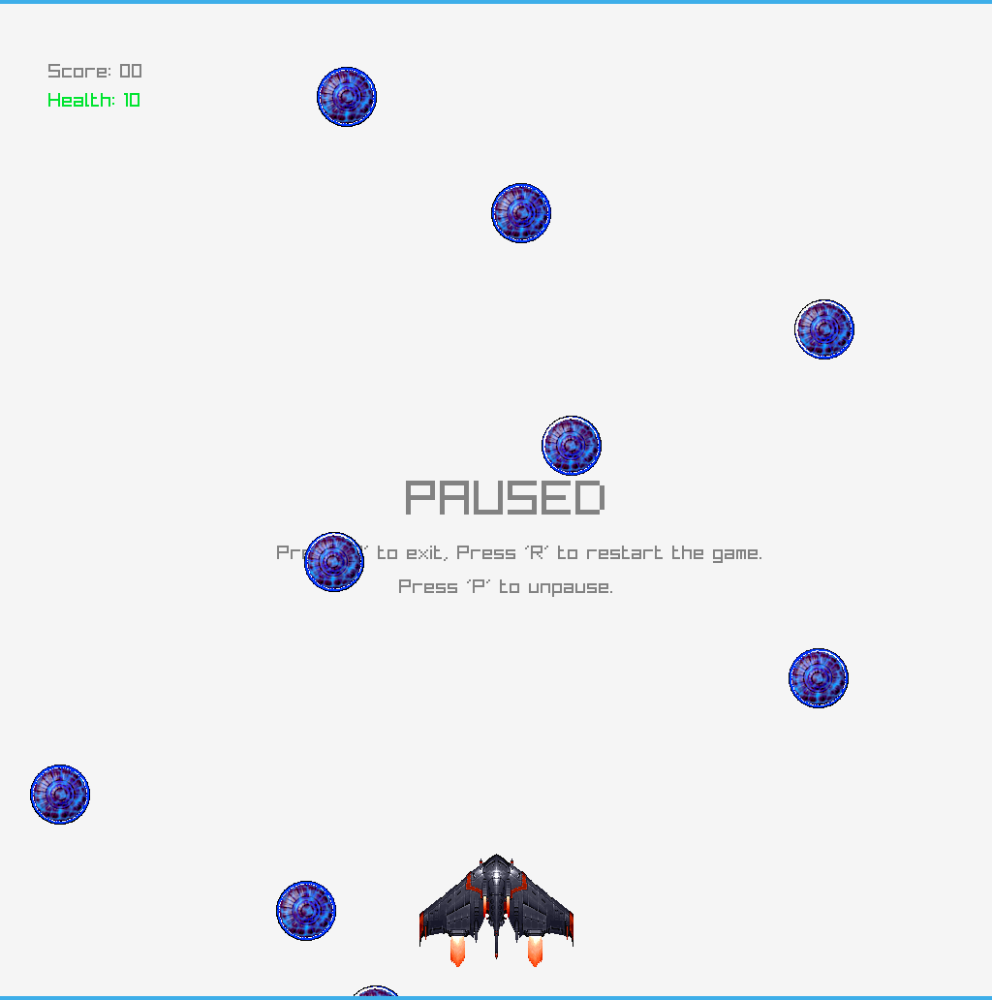

# HackMeGame
A small game demo made for the "Hacking Games for Fun and Profit" session which servers as an introduction to game hacking.

# Video
https://youtu.be/0a_qk4s-efA

# Presentation
https://docs.google.com/presentation/d/1kfBmbMYJ3qKgZLsAYT-xbOFLtUks8_qFDR6KXH2HU-M/edit?usp=sharing

# How to build
1. Install raylib, you can follow [this video](https://www.youtube.com/watch?v=UExZAEG4CF4).
2. Install glfw using `sudo apt install libglfw3-dev`.
3. Run `make`.